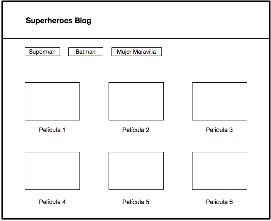
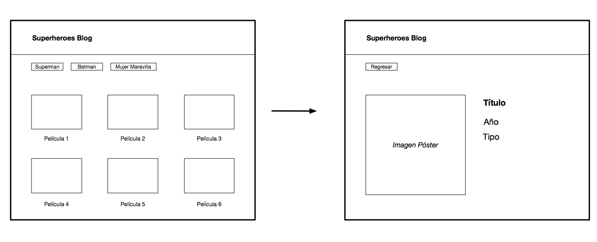
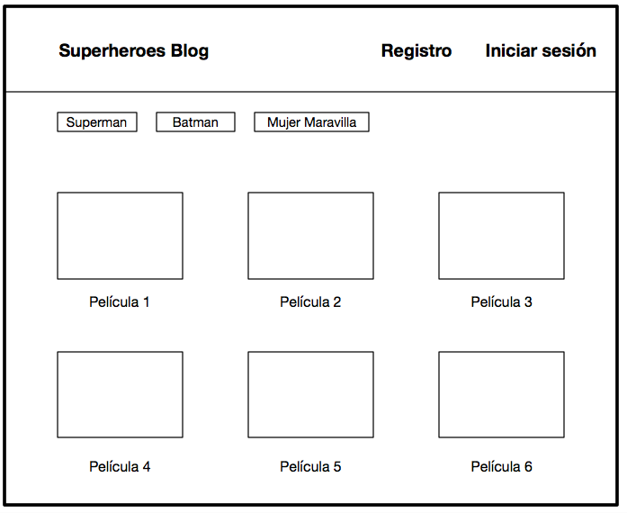

# Caso de estudio: API Movies

## Descripción

Has decidido entrar a una startup que se relaciona con la industria cinematográfica. Tienes una entrevista técnica en dos días y por ello, decides 
crear un blog para reforzar tu portafolio enfocado a este sector.

Trazas un plan técnico y propones desarrollar un catálogo que incluya películas y series con su descripción respectiva.

## Requisitos

- Despliega el proyecto en GitHub Pages.
- Tus commits deben de estar versionados a través de “git tag”, destacando los commits más relevantes del proyecto.
- Contar con un README donde incluyas:
  - Nombre del proyecto
  - Descripción
  - Proceso de instalación
- Utiliza estilos (Estlint) para JS y HTMLHint para HTML)
- Cuida tu semántica y nomenclatura dentro de tus archivos
- Si lo consideras, aplica un Framework CSS (Bootstrap, Bulma, etc.)
- Aplica todos tus aprendizajes técnicos hasta este momento para construir la aplicación.

## Alcance 1

- Obtener un API Key en [OMDB API](http://http://www.omdbapi.com/)
. Tendrás que entrar a la sección “API Key”, registrarte en
“Free” y obtener tu llave para poder consumirla.

- Leerás la documentación y armarás la URL para poder ejecutar las llamadas. Con ello, obtendrás los datos de 3 colecciones cinematográficas.
Puedes usar como búsqueda “Game of Thrones”, “Batman”, “The Crown”, "Wonder Woman", etc.

Ejemplo:

`http://www.omdbapi.com/?apikey=5f1d2a9e&s=Batman&plot=full&type=series`

- Programarás una función `getMovies` en el entorno global que retorne la colección de películas a partir de un string de búsqueda en el API de
OMDB. Recuerda incluir tu API Key también en la función para que puedas acceder a los datos.

### Argumentos:

api. String que incluye tu llave principal de acceso al API
búsqueda. String que incluye las palabras a buscar en base de datos.

### Retorno:
Un arreglo de objetos. Cada objeto incluye los valores de la película respectiva.

## Alcance 2

- Elegirás 3 series/colección de películas y crearás una aplicación que muestre sus datos en una página principal. Utiliza tu función getMovies para
requerir los datos.
- Desarrollarás una vista principal donde se muestre:

▸ Navegación. Incluye el nombre del blog.
▸ Categorías. Incluye las colecciones de películas.
▸ Poster y título. Incluye el poster individual de la película y su título respectivo.

## Alcance 3

- Al darle click a un poster, te lleva a su descripción individual. Puedes crearlo a través de un modal o con una vista
nueva. Es tu elección.

## Alcance 4

- Consideras integrar autenticación a la plataforma para comenzar tu comunidad. Esto significa que una persona pueda hacer su “login”
dentro de tu aplicación a través de una red social.  Puedes utilizar Firebase como herramienta para lograrlo.

